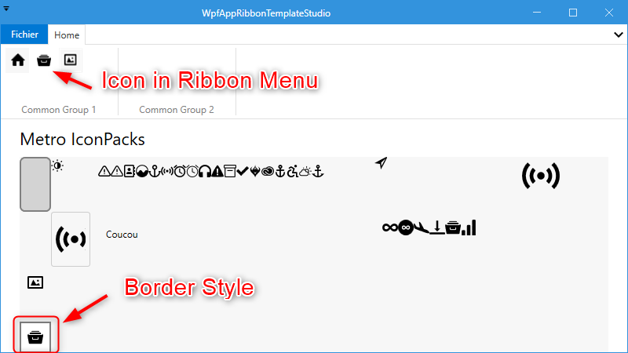

# WPF App Ribbon TemplateStudio
It is to develop from TemplateStudio which uses the ribbon in WPF Prism MvvM model.

## Requirements
I starded with :
- Visual Studio 2022 Community
- TemplateStudio Ribbon Prism

## Project in C#
- [WPF App Ribbon TemplateStudio](/WpfAppRibbonTemplateStudio)

## References

- [TemplateStudio](https://github.com/microsoft/TemplateStudio)
    > For all Microsoft Apps WinUI, WPF, UWP 
 
- [MahApps.Metro](https://github.com/MahApps/MahApps.Metro)
    > Styling the WPF application

- [MahApps.Metro.IconPacks](https://github.com/MahApps/MahApps.Metro.IconPacks)
    > Tons of icons

- [Fluent.Ribbon](https://github.com/fluentribbon/Fluent.Ribbon)
    > Manage Menu Office like

## First Step
Add a Ribbon Button To Navigate to a New Page 

## MetroIconPacksPage.xaml
To play with MahApps.Metro.IconPacks

## Second Step

Add a borner style to esealy transform Metro Icon Packs into Icon Image

