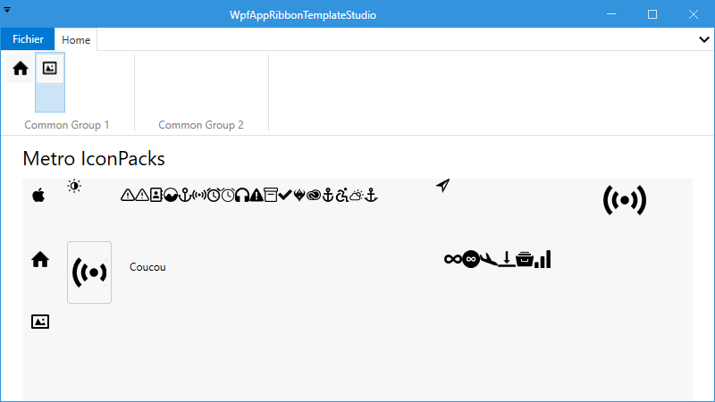

# WPF App Ribbon TemplateStudio
It is to develop from TemplateStudio which uses the ribbon in WPF Prism MvvM model.

## Requirements
I starded with :
- Visual Studio 2022 Community
- TemplateStudio Ribbon Prism

## Project in C#
- [WpfAppRibbon](/WpfAppRibbonTemplateStudio)

## First Step
Add a Ribbon Button To Navigate to a New Page 

## MetroIconPacksPage.xaml
To play with MahApps.Metro.IconPacks

